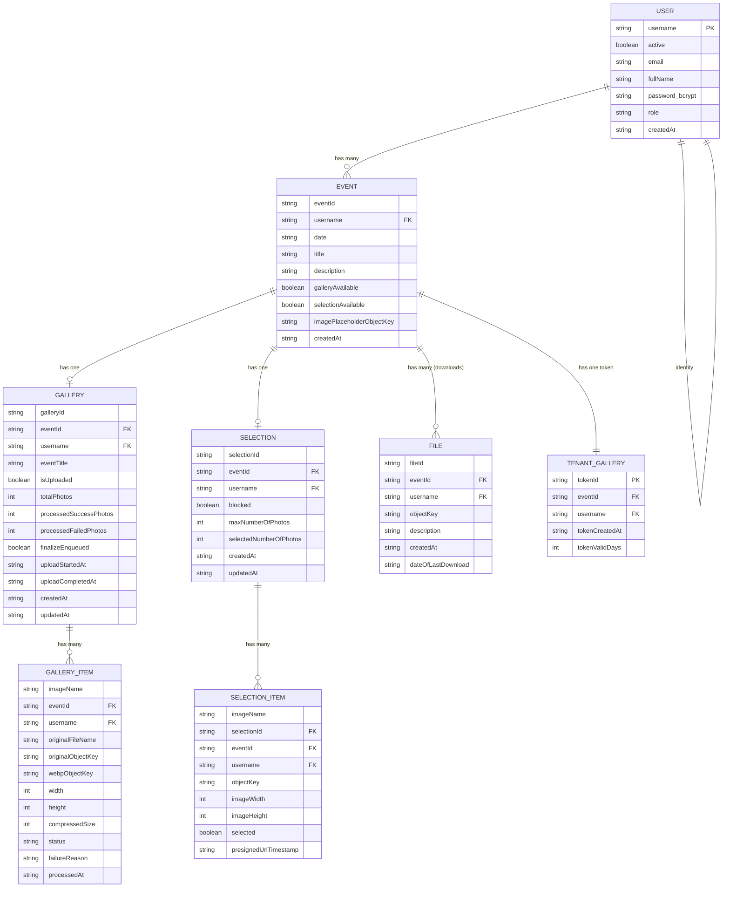
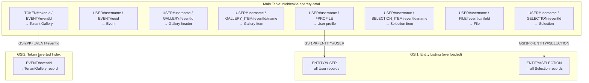

# DynamoDB Single-Table Design — Niebieskie Aparaty

## Overview

This document proposes a redesign of the current SQL-style DynamoDB schema (separate logical entities joined in code) into a proper **single-table design (STD)** that matches DynamoDB's access-pattern-first philosophy.

**Guiding principles applied:**
1. Entity-prefixed composite keys (`ENTITY#value`) prevent type collisions and enable `begins_with` filtering
2. **Item collections** (same PK, different SK) enable single-round-trip fetches of related data
3. **Sparse GSIs** — only the records that need alternate lookup carry GSI attributes; the index stays small
4. **Strict SK prefix isolation** — `EVENT#` and `GALLERY#` never share a prefix, so `begins_with("EVENT#")` can never accidentally pull gallery records

---

## Logical Entity Model



---

## Physical Table Design

**Table name:** `niebieskie-aparaty-prod` (one table for the entire application)

### Key Schema

| Entity | PK | SK | Description |
|:---|:---|:---|:---|
| User | `USER#<username>` | `#PROFILE` | Fixed SK — protects against accidental `begins_with("USER#")` collection scans |
| Event | `USER#<username>` | `EVENT#<eventId>` | Lives in the same item collection as the User |
| Gallery | `USER#<username>` | `GALLERY#<eventId>` | 1:1 per event — upload-pipeline header (counters, flags) |
| Gallery Item | `USER#<username>` | `GALLERY_ITEM#<eventId>#<imageName>` | Prefix query returns all items for one event's gallery |
| Selection | `USER#<username>` | `SELECTION#<eventId>` | 1:1 per event → always GetItem, never Query |
| Selection Item | `USER#<username>` | `SELECTION_ITEM#<eventId>#<imageName>` | Prefix query returns all items for one event's selection |
| File | `USER#<username>` | `FILE#<eventId>#<fileId>` | Prefix query scoped to one event |
| **Tenant Gallery** | `TOKEN#<tokenId>` | `EVENT#<eventId>` | Separate partition from USER — client access by tokenId alone |

### Item Collections Visualized

An **item collection** is a group of items sharing the same PK, stored together on the same partition. A single `Query` on PK retrieves all of them.

```
┌─────────────────────────────────────────────────────────────────────────────────┐
│  Partition: USER#zuza_wojtek                                                    │
│                                                                                 │
│  SK: #PROFILE                   ← User record (GetItem for profile)             │
│  SK: EVENT#<uuid-1>             ← Event 1 "Sesja ciążowa"                       │
│  SK: EVENT#<uuid-2>             ← Event 2 ...                                   │
│  SK: GALLERY#<uuid-1>           ← Gallery header (event 1)                      │
│  SK: GALLERY_ITEM#<uuid-1>#IMG_001 ← Gallery item (event 1)                     │
│  SK: GALLERY_ITEM#<uuid-1>#IMG_002 ← Gallery item (event 1)                     │
│  SK: GALLERY_ITEM#<uuid-2>#IMG_001 ← Gallery item (event 2)                     │
│  SK: SELECTION#<uuid-1>         ← Selection header (event 1)                    │
│  SK: SELECTION_ITEM#<uuid-1>#IMG_001  ← Selection item                          │
│  SK: SELECTION_ITEM#<uuid-1>#IMG_002  ← Selection item                          │
│  SK: FILE#<uuid-1>#<file-uuid>  ← Downloadable file (event 1)                  │
│                                                                                 │
│  Query: SK begins_with "EVENT#"          → only events, no gallery/files       │
│  Query: SK begins_with "GALLERY_ITEM#<uuid-1>#" → only that event's gallery items │
│  Query: SK begins_with "SELECTION_ITEM#<uuid-1>#" → only that selection items  │
└─────────────────────────────────────────────────────────────────────────────────┘

┌─────────────────────────────────────────────────────────────────────────────────┐
│  Partition: TOKEN#13fa3c4f-8a67-460f-8c07-4d3c5e098acf                         │
│                                                                                 │
│  SK: EVENT#0c8fe3d3-67c2-4611-ad52-10fa577bcaf4  ← Tenant Gallery record       │
│                                                                                 │
│  Client access: Query PK="TOKEN#<tokenId>" → 1 result (1:1 relationship)       │
│  Admin lookup:  GSI2 Query GSI2PK="EVENT#<eventId>" → resolves token           │
└─────────────────────────────────────────────────────────────────────────────────┘
```

---

## GSI Design

### GSI1 — Entity Listing Index *(sparse, overloaded)*

> **When to keep:** You need to list every record of a given entity type across the whole system (admin views, external desktop client, batch jobs).
> **When to drop:** All your queries always start with a known `username` (from JWT/session). A full-table Scan is the only alternative.

`GSI1PK` is overloaded — one value per entity type. Each entity type lives in its own GSI partition, so the listings never interfere.

| Entity | `GSI1PK` | `GSI1SK` |
|:---|:---|:---|
| User | `ENTITY#USER` | `USER#<username>` |
| Selection | `ENTITY#SELECTION` | `USER#<username>#EVENT#<eventId>` |

```
GSI1 (sparse, overloaded)

GSI1PK = ENTITY#USER
│
├── GSI1SK: USER#oaza_2025   → full User item
├── GSI1SK: USER#sm_zajac    → full User item
└── GSI1SK: USER#zuza_wojtek → full User item

GSI1PK = ENTITY#SELECTION
│
├── GSI1SK: USER#oaza_2025#EVENT#<uuid>   → full Selection item
├── GSI1SK: USER#sm_zajac#EVENT#<uuid>    → full Selection item
└── GSI1SK: USER#zuza_wojtek#EVENT#<uuid> → full Selection item
```

**Operations:**
- `Query` on GSI1 with `GSI1PK = "ENTITY#USER"` — list all users (optionally `begins_with` on GSI1SK for pagination anchoring).
- `Query` on GSI1 with `GSI1PK = "ENTITY#SELECTION"` — list all selections globally, ordered by username then eventId. Used by the desktop (Electron) client to fetch every selection across tenants.

---

### GSI2 — Tenant Gallery Inverted Index *(sparse)*

This is the classic **inverted index** pattern. The main table lets you find a token by `tokenId`. GSI2 flips it so you can find the token by `eventId`.

| Attribute | Value | Present on |
|:---|:---|:---|
| `GSI2PK` | `EVENT#<eventId>` | TenantGallery records only |
| `GSI2SK` | `TOKEN#<tokenId>` | TenantGallery records only |

```
GSI2 (sparse — only TenantGallery items projected)

GSI2PK = EVENT#0c8fe3d3-67c2-4611-ad52-10fa577bcaf4
│
└── GSI2SK: TOKEN#13fa3c4f-8a67-460f-8c07-4d3c5e098acf → full TenantGallery item
```

**Operation:** `Query` on GSI2 with `GSI2PK = "EVENT#<eventId>"` to find the associated token config.

---

## Access Patterns Reference

| # | Pattern | DynamoDB Operation | Key Condition |
|:--|:--------|:-------------------|:--------------|
| 1 | Get user profile | `GetItem` | `PK = USER#<username>` AND `SK = #PROFILE` |
| 2 | List all users (admin) | `Query` on **GSI1** | `GSI1PK = ENTITY#USER` |
| 3 | List all events for user | `Query` | `PK = USER#<username>` AND `SK begins_with EVENT#` |
| 4 | Get specific event | `GetItem` | `PK = USER#<username>` AND `SK = EVENT#<eventId>` |
| 5a | Get gallery header for event | `GetItem` | `PK = USER#<username>` AND `SK = GALLERY#<eventId>` |
| 5b | List gallery items for event | `Query` | `PK = USER#<username>` AND `SK begins_with GALLERY_ITEM#<eventId>#` |
| 6 | Get specific gallery item | `GetItem` | `PK = USER#<username>` AND `SK = GALLERY_ITEM#<eventId>#<imageName>` |
| 7 | Get selection for event | `GetItem` | `PK = USER#<username>` AND `SK = SELECTION#<eventId>` |
| 8 | List selection items for event | `Query` | `PK = USER#<username>` AND `SK begins_with SELECTION_ITEM#<eventId>#` |
| 9 | Toggle a selection item | `UpdateItem` | `PK = USER#<username>` AND `SK = SELECTION_ITEM#<eventId>#<imageName>` |
| 10 | List download files for event | `Query` | `PK = USER#<username>` AND `SK begins_with FILE#<eventId>#` |
| 11 | Client gallery access (by tokenId) | `Query` | `PK = TOKEN#<tokenId>` *(returns 1 item, 1:1 relationship)* |
| 12 | Admin: get token config by eventId | `Query` on **GSI2** | `GSI2PK = EVENT#<eventId>` |
| 13 | List all selections (desktop client) | `Query` on **GSI1** | `GSI1PK = ENTITY#SELECTION` |

---

## Example Items

### User
```json
{
  "PK":        { "S": "USER#zuza_wojtek" },
  "SK":        { "S": "#PROFILE" },
  "GSI1PK":   { "S": "ENTITY#USER" },
  "GSI1SK":   { "S": "USER#zuza_wojtek" },
  "entityType": { "S": "USER" },
  "username":  { "S": "zuza_wojtek" },
  "fullName":  { "S": "Zuza i Wojtek" },
  "email":     { "NULL": true },
  "password":  { "S": "$2b$10$2AuCJDVEzGeraaGTy02eCO4XtpURhHA50BFQ6F1qn7wrvx6lLfNvS" },
  "role":      { "S": "USER" },
  "active":    { "BOOL": true },
  "createdAt": { "S": "2026-05-04T11:49:33.933Z" }
}
```

### Event
```json
{
  "PK":          { "S": "USER#zuza_wojtek" },
  "SK":          { "S": "EVENT#0c8fe3d3-67c2-4611-ad52-10fa577bcaf4" },
  "entityType":  { "S": "EVENT" },
  "eventId":     { "S": "0c8fe3d3-67c2-4611-ad52-10fa577bcaf4" },
  "username":    { "S": "zuza_wojtek" },
  "title":       { "S": "Sesja ciążowa" },
  "date":        { "S": "2026-04-29" },
  "description": { "NULL": true },
  "galleryAvailable":          { "BOOL": true },
  "selectionAvailable":    { "BOOL": false },
  "imagePlaceholderObjectKey": { "S": "zuza_wojtek/0c8fe3d3-.../okladka.jpg" },
  "createdAt":   { "S": "2026-05-04T11:50:13.854Z" }
}
```
> `tokenId`, `tokenIdCreatedAt`, `tokenIdValidDays` **removed** — they now live in TenantGallery.

### Tenant Gallery *(new entity)*
```json
{
  "PK":          { "S": "TOKEN#13fa3c4f-8a67-460f-8c07-4d3c5e098acf" },
  "SK":          { "S": "EVENT#0c8fe3d3-67c2-4611-ad52-10fa577bcaf4" },
  "GSI2PK":     { "S": "EVENT#0c8fe3d3-67c2-4611-ad52-10fa577bcaf4" },
  "GSI2SK":     { "S": "TOKEN#13fa3c4f-8a67-460f-8c07-4d3c5e098acf" },
  "entityType":  { "S": "TENANT_GALLERY" },
  "tokenId":     { "S": "13fa3c4f-8a67-460f-8c07-4d3c5e098acf" },
  "eventId":     { "S": "0c8fe3d3-67c2-4611-ad52-10fa577bcaf4" },
  "username":    { "S": "zuza_wojtek" },
  "tokenCreatedAt":  { "S": "2026-05-19" },
  "tokenValidDays":  { "S": "30" }
}
```

### Gallery *(header, 1:1 per event)*
```json
{
  "PK":          { "S": "USER#oaza_2025" },
  "SK":          { "S": "GALLERY#be6c6d06-4328-410c-9435-c2a2b0395722" },
  "entityType":  { "S": "GALLERY" },
  "galleryId":   { "S": "5cf0f8c1-9c12-4f88-a8b4-2a3c1b5d6e77" },
  "eventId":     { "S": "be6c6d06-4328-410c-9435-c2a2b0395722" },
  "username":    { "S": "oaza_2025" },
  "eventTitle":  { "S": "Sesja plenerowa" },
  "isUploaded":              { "BOOL": false },
  "totalPhotos":             { "NULL": true },
  "processedSuccessPhotos":  { "N": "0" },
  "processedFailedPhotos":   { "N": "0" },
  "finalizeEnqueued":        { "BOOL": false },
  "uploadStartedAt":         { "S": "2026-06-10T12:00:00.000Z" },
  "uploadCompletedAt":       { "NULL": true },
  "createdAt":   { "S": "2026-06-10T12:00:00.000Z" },
  "updatedAt":   { "S": "2026-06-10T12:00:00.000Z" }
}
```
> Mirrors the Selection header (race-safe `finalizeEnqueued` gate + atomic `ADD` counters). No `blocked` / `maxNumberOfPhotos` / `selectedNumberOfPhotos` — those are selection-only (client-pick flow).

### Gallery Item
```json
{
  "PK":          { "S": "USER#oaza_2025" },
  "SK":          { "S": "GALLERY_ITEM#be6c6d06-4328-410c-9435-c2a2b0395722#IMG_6225" },
  "entityType":  { "S": "GALLERY_ITEM" },
  "eventId":     { "S": "be6c6d06-4328-410c-9435-c2a2b0395722" },
  "username":    { "S": "oaza_2025" },
  "imageName":   { "S": "IMG_6225" },
  "originalFileName":  { "S": "IMG_6225.JPG" },
  "originalObjectKey": { "S": "oaza_2025/be6c6d06-.../original/IMG_6225.JPG" },
  "webpObjectKey":     { "S": "oaza_2025/be6c6d06-.../compressed/IMG_6225.webp" },
  "width":           { "N": "2500" },
  "height":          { "N": "3750" },
  "compressedSize":  { "N": "1843211" },
  "status":          { "S": "processed" },
  "failureReason":   { "NULL": true },
  "processedAt":     { "S": "2026-06-10T12:01:14.722Z" }
}
```
> Mirrors the SelectionItem shape. `originalObjectKey` is kept permanently (no transient bucket — originals are downloadable forever). Failed rows still exist with `status: 'failed'` so the UI can show "12 of 1500 failed".
> Presigned URLs are not stored — they are generated on-demand to avoid stale URLs.

### Selection
```json
{
  "PK":          { "S": "USER#sm_zajac" },
  "SK":          { "S": "SELECTION#bce937cd-1a3a-41c5-a74f-3973f726386e" },
  "GSI1PK":      { "S": "ENTITY#SELECTION" },
  "GSI1SK":      { "S": "USER#sm_zajac#EVENT#bce937cd-1a3a-41c5-a74f-3973f726386e" },
  "entityType":  { "S": "SELECTION" },
  "selectionId": { "S": "d18e8799-aef7-48b2-a343-1c8fbef1fa64" },
  "eventId":     { "S": "bce937cd-1a3a-41c5-a74f-3973f726386e" },
  "username":    { "S": "sm_zajac" },
  "eventTitle":  { "S": "..." },
  "blocked":     { "BOOL": false },
  "maxNumberOfPhotos":      { "N": "100" },
  "selectedNumberOfPhotos": { "N": "147" },
  "createdAt":   { "S": "..." },
  "updatedAt":   { "S": "..." }
}
```
> `selectedImages` list attribute **removed** — count stays; full selection state is derived from individual `SelectionItem` records, avoiding the 400KB item size limit risk.
> **Note (2026-06-11):** Selection used to mirror the Gallery header (`isUploaded`, `totalPhotos`, `processedSuccessPhotos`, `processedFailedPhotos`, `finalizeEnqueued`, `uploadStartedAt`, `uploadCompletedAt`) when uploads went through the Lambda pipeline in `selection-serverless/`. Those attributes were dropped after the photographer moved compression + watermarking client-side — the row now only stores metadata, and `Event.selectionAvailable` is flipped in the same TransactWrite that creates the Selection. See `selection-knowledge/architecture.md` §0 for the current flow.

### Selection Item
```json
{
  "PK":          { "S": "USER#sm_zajac" },
  "SK":          { "S": "SELECTION_ITEM#bce937cd-1a3a-41c5-a74f-3973f726386e#IMG_3588" },
  "entityType":  { "S": "SELECTION_ITEM" },
  "selectionId": { "S": "d18e8799-aef7-48b2-a343-1c8fbef1fa64" },
  "eventId":     { "S": "bce937cd-1a3a-41c5-a74f-3973f726386e" },
  "imageName":   { "S": "IMG_3588" },
  "username":    { "S": "sm_zajac" },
  "objectKey":   { "S": "sm_zajac/bce937cd-.../selection/IMG_3588.jpg" },
  "imageWidth":  { "N": "1496" },
  "imageHeight": { "N": "2244" },
  "selected":    { "BOOL": false },
  "presignedUrlTimestamp": { "S": "2026-06-01T02:00:26.629Z" }
}
```

### File
```json
{
  "PK":          { "S": "USER#zuza_wojtek" },
  "SK":          { "S": "FILE#0c8fe3d3-67c2-4611-ad52-10fa577bcaf4#f49d4a43-df70-4d92-a290-65839224c3ed" },
  "entityType":  { "S": "FILE" },
  "fileId":      { "S": "f49d4a43-df70-4d92-a290-65839224c3ed" },
  "eventId":     { "S": "0c8fe3d3-67c2-4611-ad52-10fa577bcaf4" },
  "username":    { "S": "zuza_wojtek" },
  "objectKey":   { "S": "zuza_wojtek/0c8fe3d3-.../gotowe.zip" },
  "description": { "S": "zdjęcia do pobrania, najwyższa jakość" },
  "createdAt":   { "S": "2026-05-08T12:13:20.770Z" },
  "dateOfLastDownload": { "NULL": true }
}
```

---

## Key Design Decisions & Rationale

### 1. Why `selectionId` is demoted to an attribute
In the old schema, `selectionId` was the primary key of the Selection table, and SelectionItems referenced it. In STD, the event's SK (`SELECTION#<eventId>` and `SELECTION_ITEM#<eventId>#...`) makes `selectionId` redundant as a key. It's kept as a plain attribute for audit trails and any external system compatibility.

### 2. Why `selectedImages` list is removed from Selection
The old Selection record embedded a list of all selected image names. With 147 items in a real example, this list will grow proportionally to the number of photos in a session. At scale (1000+ photos), this risks hitting DynamoDB's 400 KB item size limit and causes full item rewrites on every toggle. Selection state now lives exclusively in individual `SelectionItem.selected` boolean attributes — toggle = `UpdateItem` on one tiny record.

### 3. Why TenantGallery is a separate partition (`TOKEN#...`)
The token is the client's entry point — they have a URL like `/gallery/<tokenId>` with no username. If TenantGallery were stored under `USER#<username>`, a client arriving with only a tokenId would need a GSI to resolve the username first, then a second query to get the data — two round trips. With `PK = TOKEN#<tokenId>`, the client resolves the full gallery config in one `Query` call.

### 4. Why TenantGallery SK = `EVENT#<eventId>` and not `#METADATA`
The SK encodes the relationship, making the record self-describing. It also positions the design for future extension: if an event ever needs multiple token configurations (e.g., a photographer token vs. a client preview token), the SK would differentiate them. The GSI2 inverted index lets the admin panel do `eventId → token` lookup without knowing the tokenId upfront.

### 5. Why Selection has no upload-progress fields

The Selection row used to mirror the Gallery header — counters (`processedSuccessPhotos`, `processedFailedPhotos`), totals (`totalPhotos`), a `finalizeEnqueued` gate, and timestamps. Those existed because uploads ran through a distributed Lambda pipeline that needed a per-batch progress record to coordinate idempotent counter bumps and a race-safe "we are done" handshake. After the photographer moved compression and watermarking to their own machine (2026-06-11), the pipeline was retired: the browser uploads finished bytes directly to the main bucket, and the server writes all `SelectionItem` rows + the `Selection` row + flips `Event.selectionAvailable = true` in one HTTP request (BatchWrite for items, TransactWrite for the row + event flag). With no asynchronous processing in the loop, there is nothing to coordinate, so the row only stores metadata.

### 6. Why presigned URLs are not stored on Gallery Items
Presigned URLs expire. Storing them means the stored value becomes invalid after `X-Amz-Expires` (currently 7 days). Every re-fetch must either regenerate the URL or serve a stale one. The pattern: store only `objectKey` + `presignDateTime` (for cache invalidation awareness), generate presigned URLs server-side at request time.

---

## Migration: Old → New Attribute Mapping

| Old Table | Old Key | New PK | New SK | Changed Attributes |
|:---|:---|:---|:---|:---|
| Users | `username` | `USER#<username>` | `#PROFILE` | Add `GSI1PK`, `GSI1SK` |
| Events | `eventId` | `USER#<username>` | `EVENT#<eventId>` | Remove `tokenId`, `tokenIdCreatedAt`, `tokenIdValidDays` |
| *(new)* | — | `USER#<username>` | `GALLERY#<eventId>` | Gallery upload-pipeline header (`galleryId`, counters, `finalizeEnqueued`, `isUploaded`, timestamps) |
| GalleryItems | `eventId` + `fileName` | `USER#<username>` | `GALLERY_ITEM#<eventId>#<imageName>` | Rewritten to mirror SelectionItem: `originalFileName`, `originalObjectKey`, `webpObjectKey`, `width`, `height`, `compressedSize`, `status`, `failureReason`, `processedAt` |
| Selections | `selectionId` | `USER#<username>` | `SELECTION#<eventId>` | Remove `selectedImages` list; `selectionId` becomes attribute; **also (2026-06-11)** drop all upload-pipeline attributes (`isUploaded`, `totalPhotos`, `processedSuccessPhotos`, `processedFailedPhotos`, `finalizeEnqueued`, `uploadStartedAt`, `uploadCompletedAt`) — Selection is created only after all uploads complete, in a TransactWrite that also flips `Event.selectionAvailable = true`. **2026-06-12:** project into GSI1 with `GSI1PK = ENTITY#SELECTION`, `GSI1SK = USER#<username>#EVENT#<eventId>` so the desktop client can list every selection globally. |
| SelectionItems | `selectionId` + `imageName` | `USER#<username>` | `SELECTION_ITEM#<eventId>#<imageName>` | No change to attributes (`presignedUrlTimestamp` was never persisted by the new flow — presigned URLs are generated on demand) |
| Files | `fileId` | `USER#<username>` | `FILE#<eventId>#<fileId>` | No change to attributes |
| *(new)* | — | `TOKEN#<tokenId>` | `EVENT#<eventId>` | `tokenId`, `tokenCreatedAt`, `tokenValidDays`, `eventId`, `username`, `GSI2PK`, `GSI2SK` |

---

## Summary Diagram



---

## AWS Console Setup

### Step 1 — Create the table

Go to **AWS Console → DynamoDB → Tables → Create table**.

| Field | Value |
|:---|:---|
| Table name | `niebieskie-aparaty-prod` |
| Partition key | `PK` — type **String** |
| Sort key | `SK` — type **String** |
| Table class | **DynamoDB Standard** |
| Capacity mode | **On-demand** *(pay-per-request — recommended for variable photo session load)* |

Leave everything else at defaults and click **Create table**.

---

### Step 2 — Add GSI1 (Entity Listing Index)

After the table is created, open it → **Indexes** tab → **Create index**.

| Field | Value |
|:---|:---|
| Partition key | `GSI1PK` — type **String** |
| Sort key | `GSI1SK` — type **String** |
| Index name | `GSI1` |
| Attribute projections | **All** *(copies full item into GSI — simpler; switch to KEYS_ONLY to save cost if needed)* |

Click **Create index** and wait for status to become `ACTIVE`.

> **Skip this GSI** if your app never needs to list all users globally — you always know the `username` from the JWT session token.

---

### Step 3 — Add GSI2 (Token Inverted Index)

Still in **Indexes** → **Create index**.

| Field | Value |
|:---|:---|
| Partition key | `GSI2PK` — type **String** |
| Sort key | `GSI2SK` — type **String** |
| Index name | `GSI2` |
| Attribute projections | **All** |

Click **Create index** and wait for `ACTIVE`.

---

### Step 4 — Enable TTL for TenantGallery auto-expiry *(recommended)*

Tokens have a finite validity window (`tokenValidDays`). Instead of running a cleanup job, DynamoDB can auto-delete expired TenantGallery items.

Go to **Table → Additional settings → Time to Live (TTL)** → **Enable**.

| Field | Value |
|:---|:---|
| TTL attribute name | `ttl` |

Then, when writing a **TenantGallery** item, compute the Unix epoch expiry and store it:

```js
// Node.js example
const tokenCreatedAt = new Date("2026-05-19");
const validDays = 30;
const ttl = Math.floor(tokenCreatedAt.getTime() / 1000) + validDays * 86400;
// store: { ttl: { N: String(ttl) } }
```

DynamoDB will delete the item within ~48 hours after `ttl` passes — no Lambda, no cron.

---

### Step 5 — Enable Point-in-Time Recovery *(recommended)*

Go to **Table → Additional settings → Point-in-time recovery (PITR)** → **Enable**.

This gives you a continuous 35-day backup window. If you accidentally delete all gallery items for a user, you can restore to any second in the last 35 days. Costs ~$0.20/GB/month — worth it for user photo data.

---

### Step 6 — Verify table structure

In the **Indexes** tab you should see:

```
GSI1   GSI1PK (S) / GSI1SK (S)   ACTIVE
GSI2   GSI2PK (S) / GSI2SK (S)   ACTIVE
```

In the **Overview** tab:

```
Primary partition key:  PK (String)
Primary sort key:       SK (String)
Capacity mode:          On-demand
TTL attribute:          ttl
```

---

### IAM permissions (minimum required)

Your Lambda / server needs these DynamoDB actions on the table ARN and its GSI ARNs:

```json
{
  "Effect": "Allow",
  "Action": [
    "dynamodb:GetItem",
    "dynamodb:PutItem",
    "dynamodb:UpdateItem",
    "dynamodb:DeleteItem",
    "dynamodb:Query"
  ],
  "Resource": [
    "arn:aws:dynamodb:<region>:<account>:table/niebieskie-aparaty-prod",
    "arn:aws:dynamodb:<region>:<account>:table/niebieskie-aparaty-prod/index/GSI1",
    "arn:aws:dynamodb:<region>:<account>:table/niebieskie-aparaty-prod/index/GSI2"
  ]
}
```

> **No `Scan` permission needed** — the single-table design eliminates all Scan operations.
